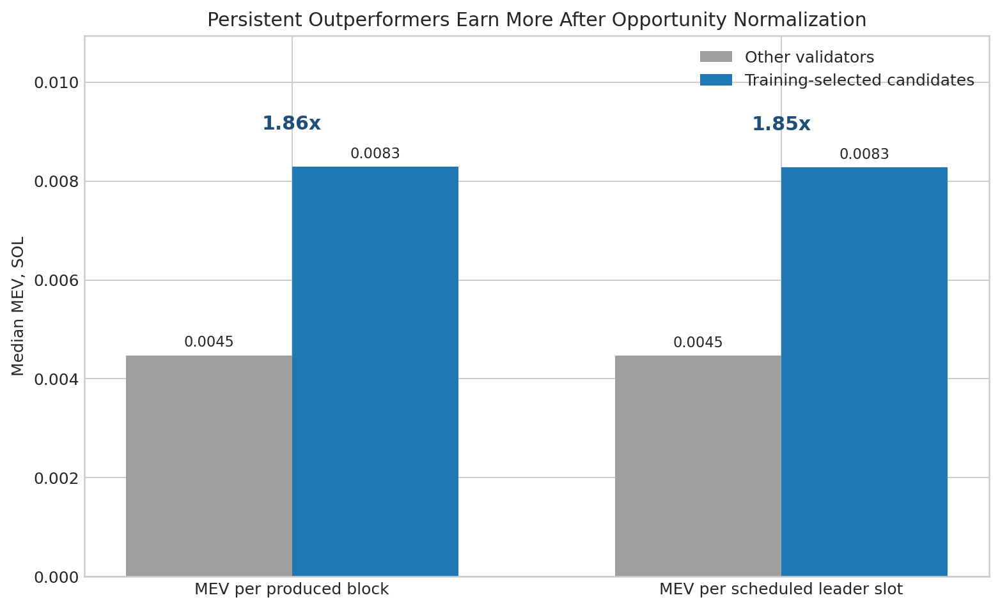
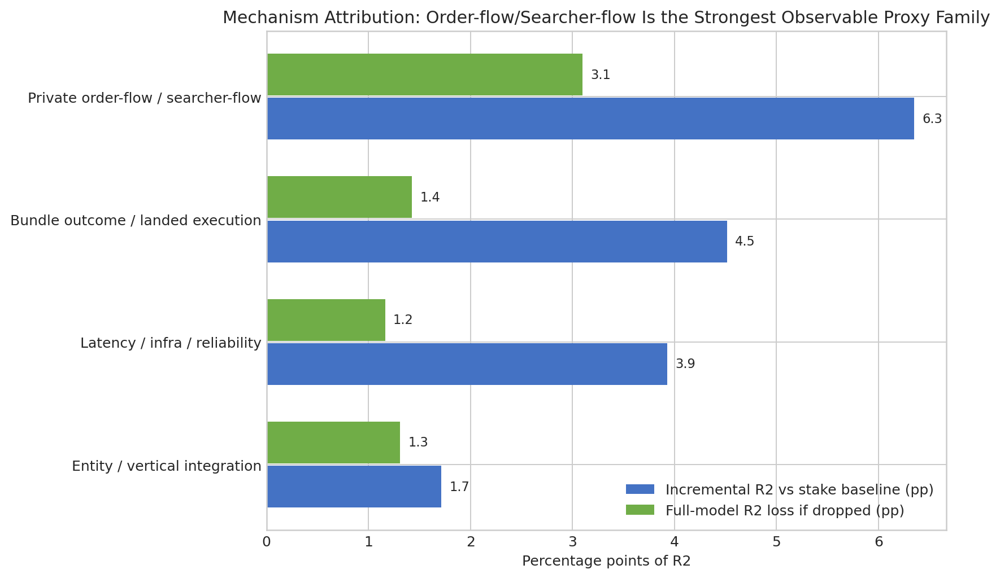

# Jito Block Auction Competitiveness Analysis - Executive Report

## One-sentence answer

The Jito block auction does not look like a simple winner-take-all rent machine purely from aggregate concentration, because much of top-level allocation is consistent with stake and block-production opportunity. However, the data show persistent validator-specific outperformance that survives produced-block and scheduled-leader-slot normalization and remains visible after observable controls. The best current description is: broadly stake-proportional at the aggregate level, but with persistent validator-level extraction edge consistent with structural advantages in order-flow/searcher-flow or execution quality.

## Executive summary

- **Market concentration exists:** average MEV Gini is **0.775**; the top 10 validators receive **29.1%** of MEV and the top 25 receive **43.4%**.
- **Concentration alone is not proof of structural rent:** stake is also concentrated, and latest-epoch stake share and MEV share are strongly related (**correlation 0.788**).
- **The stronger evidence is persistent validator-specific outperformance:** **57** validators pass the persistent-outperformer screen.
- **The edge survives opportunity normalization:** candidates earn **1.86x** the median MEV per produced block and **1.85x** the median MEV per scheduled leader slot.
- **The strongest observable mechanism proxy is order-flow/searcher-flow:** v21's final benchmark has **R2=0.816** and identifies order-flow/searcher-flow as the strongest fit-contribution family. This is proxy evidence, not causal proof.

## Direct answers to the email questions

| Email question | Short answer | Key evidence | Caveat |
| --- | --- | --- | --- |
| Is the Jito auction broadly competitive or structurally rent-extracting? | Mixed: broadly stake-proportional at the aggregate level, but not fully competitive at the validator-performance level. | Top rewards are concentrated, yet stake share and MEV share are strongly related; persistent candidates still earn ~1.86x per produced block and ~1.85x per scheduled leader slot. | Observational/proxy evidence, not causal proof. |
| Are rewards concentrated? | Yes. | Average MEV Gini is 0.775; top 10 validators receive 29.1%; top 25 receive 43.4%. | Concentration can arise mechanically from stake and leader opportunity. |
| Is concentration explained by stake? | Partly. | Latest completed epoch stake-share vs MEV-share correlation is 0.788; active-stake Gini is also high at 0.733. | This does not rule out individual validator-level edge. |
| Are there persistent outperformers? | Yes. | 57 validators meet the pre-specified persistent outperformance screen; top candidate average excess MEV share is 3.74%. | Persistence may still reflect unobserved variables. |
| Does the edge survive block/leader normalization? | Yes. | Candidate median MEV per produced block is 1.86x other validators; per scheduled leader slot is 1.85x. | Leader-slot and block-level data are still proxy-based. |
| What best explains the edge? | The strongest observable proxy family is private order-flow/searcher-flow. | Order-flow/searcher-flow has the largest incremental R2 vs stake baseline (0.063) and largest drop-one fit contribution (0.031). | It cannot directly identify private searcher-validator relationships. |
| Is it due to latency/software/vertical integration? | Possible, but not proven. | Latency/infra and landed-execution proxies provide partial support; entity/vertical integration is suggestive and has the strongest positive candidate attenuation. | Need raw latency, bundle lifecycle, searcher identity, and ownership/operator mapping. |

## Key evidence

| Result | Value |
| --- | --- |
| Completed epochs used | 983-992 (10 epochs) |
| Average MEV Gini | 0.775 |
| Top 10 / top 25 MEV share | 29.1% / 43.4% |
| Latest stake-share vs MEV-share correlation | 0.788 |
| Persistent outperformer candidates | 57 validators |
| Candidate MEV per produced block | 1.86x other validators |
| Candidate MEV per scheduled leader slot | 1.85x other validators |
| Final v21 benchmark model | N=411, R2=0.816, adjusted R2=0.781 |
| Candidate coefficient in final benchmark | 0.316, p=0.0014 |

## Mechanism attribution summary

| Mechanism family | Evidence strength | Incremental R2 vs stake baseline | R2 loss if dropped | Candidate attenuation vs stake baseline | Status |
| --- | --- | --- | --- | --- | --- |
| Latency / infra / reliability | partial / indirect | 0.039 | 0.012 | -0.020 | partially tested |
| Private order-flow / searcher-flow | strongest among available proxies | 0.063 | 0.031 | -0.103 | strongest current proxy family |
| Bundle outcome / landed execution | partial / landed-only | 0.045 | 0.014 | -0.525 | partially tested |
| Entity / vertical integration | weak / suggestive | 0.017 | 0.013 | 0.097 | weak proxy only |

## Interpretation

1. **Market structure:** MEV rewards are concentrated, but active stake is also concentrated, so concentration alone does not prove rent extraction.
2. **Stake proportionality:** aggregate allocation is partly stake-proportional; this weakens a simple "large validators extract rent" story.
3. **Persistent edge:** the more important evidence is persistent validator-level outperformance after opportunity normalization.
4. **Mechanism:** among available public/proxy variables, order-flow/searcher-flow is the strongest explanation. Latency/infra and landed-execution proxies are partial. Entity/vertical integration is possible but weakly measured.

## What this report does not prove

This analysis does **not** prove private searcher-validator relationships, raw latency advantage, ownership/vertical integration, rejected-bundle dynamics, or the causal effect of any one mechanism. The analysis is observational and based on public/proxy data.

## Data that would make the mechanism claim causal

- Bundle IDs across submitted, landed, and rejected bundles.
- Searcher identity or stable searcher labels.
- Validator-searcher pairing history.
- Relay arrival timestamps and raw latency distributions.
- Block-builder/RPC/validator operator mapping.
- Ownership or commercial affiliation data.
- Full auction bid and clearing data.

## Appendix files to share if requested

- `clean_analysis_reviewed_improved_v21.ipynb`: full reproducible notebook.
- `jito_analysis_reviewed_improved_v21.xlsx`: final tables, dashboard, mechanism attribution, drift/data-loss audit.
- `clean_analysis_reviewed_improved_v21_data_variables.md`: variable definitions and construction notes.
- `clean_analysis_reviewed_improved_v21_api_acquisition.md`: API acquisition notes and limitations.
